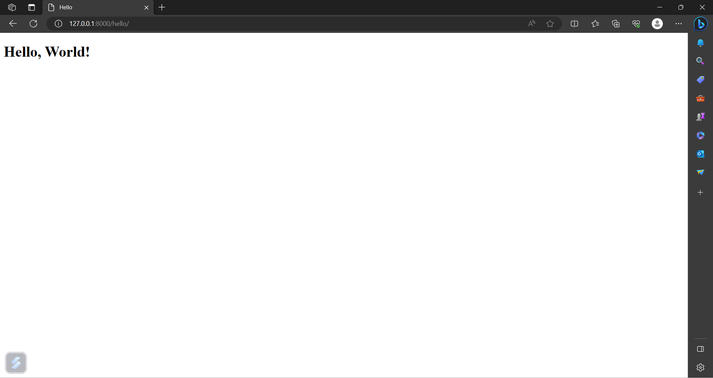

# steptech_assignment
A simple Django application to create and read the users information using MySQL database.

# Setting up the Django environment
## Install Python
1. Go to official Python download page(https://www.python.org/download)
2. Download Python3 version <= 11 to support django.
3. Run the installer file. Click "Add path to environment variables" when you install on windows.
4. Once finish the installation, open the terminal.
5. Run 'python' -> returns python interactive environment with version.
6. After all fine, run  "pip install django"(The pip package collect all the required libraries to create django project).
7. Create new directory for django project. Open & change the directory in terminal.
8. Run "django-admin startproject SimpleApplication" to create a django project.
9. Once created run "cd SimpleApplication", move to child base directory(The base child name is also same as parent name).
10. Run "python manage.py runserver" to check basic django works fine.
11. Then create apps for tasks. In our case, we have three tasks(Hello messgae, Register users, Retrieve users detail).
12. Run "python manage.py startapp hello" to create an app.
13. Repeat the above step to create other two apps.
14. Add urls.py for all three apps to access the apps from the base application.
15. Add required request method to views.py, add the methods to urlpatterns in urls.py

## Setup Local MySQL database
1. Go to official mysql download page, click the 32-bit installer exe file(It supports 64 bit machine also).
2. Run the .exe file, Install MySQL server, MySQL workbench and MySQL shell in the interactive window.
3. Then leave all the checkboxes default, click "Next" repeated until the installation finish.
4. Set the username and password for MySQL server.
5. Once finish, go to C:\Program Files\MySQL\MySQL Server\bin. Copy path and paste it in environment variables.
6. Open the terminal, run "mysql --version" to check the mysql is installed correctly.
7. After successfully installed, run "mysql -u username -p" -> then enter the password to access the mysql database.
8. Run "create database users;" in the interactive shell to create a database.
9. Run "use users;" to select the users database.
10. Run "create table users(id int not null primary key, name varcahar(255), email varchar(255), role varchar(255));" to create the table with given parameters(cols).
11. Move to django project, open the settings.py file change the DATABASE variable from sqlite -> mysql server(name, host, port, database).
12. Run "python manage.py makemigrations" to migrate all the models.
13. Run "python manage.py migrate" will migrate it into initial models.
14. Run "python manage.py runserver" -> log with localhost web address. Copy & paste the localhost url in web browser.
15. Append "hello" to the url, it returns the "Hello, World!" response to the webpage.

16. Run "localhost:port/new_user", fill the textbox then "Click to register" button to register.

17. Follow step 16 with "users" parameters, the request will retrieve all the users detail.

18. Append the user id to the url parameter, get the specific user id details.

